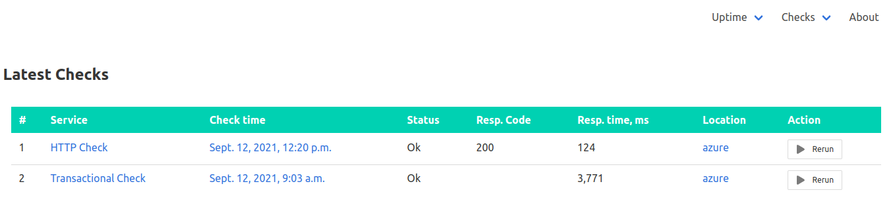
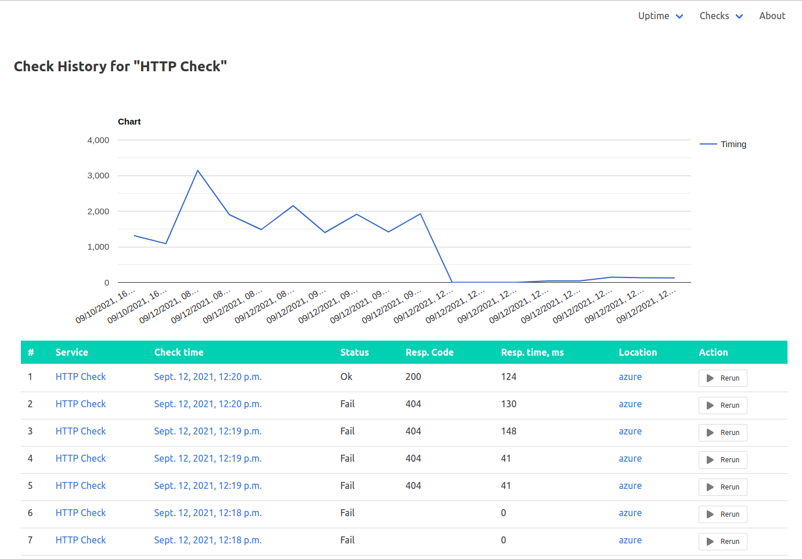

# uptime_monitor

An Uptime Monitor with an extensible checking mechanism

## Prerequisites

* Python3.6+
* SQLite 3+ or MySQL 5.7+
* Selenium driver (check Selenium official documentation)

## How-To

### Install the application

* Clone the repository
* Run `pip3 install -r requirements.txt`
* Copy monitor/settings.example.py to monitor/settings.py, read and adjust (SQL, SMTP, notifications, etc)
* Run `python3 managey.py migrate` to apply all required migrations
* Run `python3 managey.py createsuperuser` to add an admin panel user
* Run `python3 managey.py test` to run the available unit tests
* Create configuration files under conf.d (or any other folder you set in settings.py as the base path for config files)
* Run `python3 managey.py runcheck` to run all the configured checks OR
* Run `python3 managey.py runcheck <--check-name|-c> <check_id>` to run only the check with the ID
